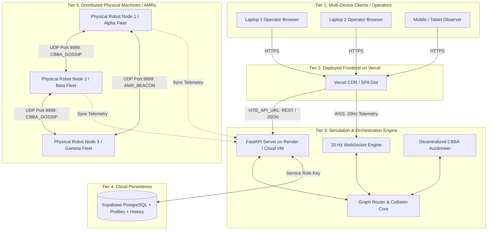

# AMR Fleet Management & CBBA System: Production Deployment & Multi-Device Network Architecture

## 1. Executive Architecture Overview

The system is designed as a **Hybrid Decentralized Autonomous Architecture** with three distinct tiers:
1. **Presentation & Monitoring Tier (Vercel / Browser):** 3D digital twin rendered in Three.js/React, connecting via 20 Hz WebSockets and REST.
2. **Execution & Simulation Core (FastAPI / Render / On-Prem Edge):** Multi-agent motion planner, graph routing, and dynamic CBBA consensus engine.
3. **Decentralized Multi-Laptop Mesh Tier (UDP Port 9999):** Peer-to-peer gossip protocol enabling multiple physical machines to coordinate tasks without single points of failure.
4. **Cloud State & Persistence Tier (Supabase):** Shared state for user accounts, task history, and persistent fleet telemetry.

---

## 2. Three Connection Workflows

Depending on your demonstration or production scenario, the system operates in three flexible topologies:

### Mode A: Full Cloud Deployment (Zero Local Setup for Clients)
* **Best for:** Cross-city demos, remote evaluation, supervisor dashboards.
* **How it works:**
  1. The backend runs 24/7 on Render / Railway (`https://your-backend.onrender.com`).
  2. The frontend is hosted on Vercel (`https://your-app.vercel.app`).
  3. Device 1 (You) and Device 2 (Your friend) simply visit the Vercel URL on phones, laptops, or tablets from anywhere in the world.
  4. All movements, robot spawns, and task biddings sync in real time over WebSockets and Supabase.

---

### Mode B: Hybrid Cloud + Edge (Cloud Dashboard with Physical Local AMRs)
* **Best for:** Hardware-in-the-loop or multi-laptop demo with a central cloud monitor.
* **How it works:**
  1. The central dashboard is accessed via Vercel.
  2. Each physical laptop runs a local agent node (`main.py`) representing its AMR fleet.
  3. Laptops communicate locally over the **UDP Mesh** for ultra-fast (sub-millisecond) CBBA bidding and send their telemetry status to the cloud backend.

---

### Mode C: Pure Local Area Network (LAN) / Multi-Laptop Mesh
* **Best for:** Isolated warehouse networks, offline defense demos, campus labs without internet.
* **How it works:**
  1. Laptop 1 runs `python main.py config/sim_config.json` (Fleet: `alpha`).
  2. Laptop 2 runs `python main.py config/sim_config_peer.json` (Fleet: `beta`).
  3. Both laptops are on the same Wi-Fi / Hotspot.
  4. Packets flow directly laptop-to-laptop over UDP Port `9999` using Round-Robin Time-Division Gossip.
  5. Each user opens `http://localhost:3000` (or `http://<LAPTOP_1_IP>:3000`).

---

## 3. Step-by-Step Production Deployment Guide

### Phase 1: Database Setup (Supabase)
1. In your Supabase Project (`https://supabase.com`):
   * Note the **Project URL**: `https://dpyhtcbbcoihxhcvkhus.supabase.co/`
   * Note the **Service Role Secret Key** from Project Settings -> API.
2. Tables utilized:
   * `profiles` (User authentication, assigned AMR ID, operator role).
   * `tasks` (Pending, active, and completed warehouse mission log).

---

### Phase 2: Backend Deployment (Render / Railway)
1. Push your repository to GitHub.
2. Create a new **Web Service** on [Render.com](https://render.com) (or Railway):
   * **Runtime:** Python 3
   * **Build Command:** `pip install -r requirements.txt`
   * **Start Command:** `uvicorn backend.server:app --host 0.0.0.0 --port $PORT`
3. Add Environment Variables:
   * `SUPABASE_URL` = `https://dpyhtcbbcoihxhcvkhus.supabase.co/`
   * `SUPABASE_SERVICE_ROLE_KEY` = `<your-service-role-key>`
   * `PORT` = `8000` (or auto-assigned by host)
4. Copy your live backend URL (e.g. `https://amr-fleet-backend.onrender.com`).

---

### Phase 3: Frontend Deployment (Vercel)
1. Link your repository in [Vercel](https://vercel.com).
2. The project includes `vercel.json` which auto-configures:
   * **Build Command:** `cd viewer && npm install && npm run build`
   * **Output Directory:** `viewer/dist`
3. Under **Project Settings -> Environment Variables**, add:
   * **`VITE_API_URL`**: `https://amr-fleet-backend.onrender.com` *(your live Render backend URL)*
4. Click **Deploy**. Vercel will generate your frontend URL (e.g. `https://amr-fleet-viewer.vercel.app`).

---

## 4. End-to-End Multi-Device Verification Test

To verify complete end-to-end connectivity across two devices:

| Step | Action on Device 1 (You) | Action on Device 2 (Peer / Friend) | Expected Live Result |
| :--- | :--- | :--- | :--- |
| **1. Health Check** | Navigate to `https://<backend-url>/api/health` in browser | Navigate to `https://<backend-url>/api/health` | Both receive `{"status": "ok", "supabase_connected": true}` |
| **2. Login & Spawn** | Open Frontend -> Sign in -> Click `+ Spawn AMR` at node `n1` | Open Frontend -> Sign in -> Click `+ Spawn AMR` at node `n7` | Both screens immediately render 2 robots (`alpha-amr-1` and `beta-amr-2`) |
| **3. Dispatch Mission** | Open `Dispatch` tab -> Create task from `n10` to `n5` | Watch 3D screen | CBBA auction executes in real time; the nearest AMR bids and travels along the optimal route on both screens |
| **4. P2P Mesh Diagnostics** | Open `P2P Mesh` tab | Open `P2P Mesh` tab | Packet counters, active peer IPs, and round-trip latency are live and matching |

---

## 5. Network Failover & Resilience

The architecture incorporates automatic self-healing:
1. **WebSocket Drop Recovery:** If network quality drops on mobile/Wi-Fi, the frontend instantly falls back to a 200ms REST polling loop (`/api/amrs`) so robots never freeze on screen.
2. **UDP Packet Loss Defense:** CBBA uses timestamped state vectors ($s_i$) so out-of-order or dropped UDP packets do not corrupt task assignment consensus.
3. **Hot-Reloading Topology:** When a new operator logs in from another laptop, the backend broadcasts an instant state snapshot so the new device syncs in zero seconds.
